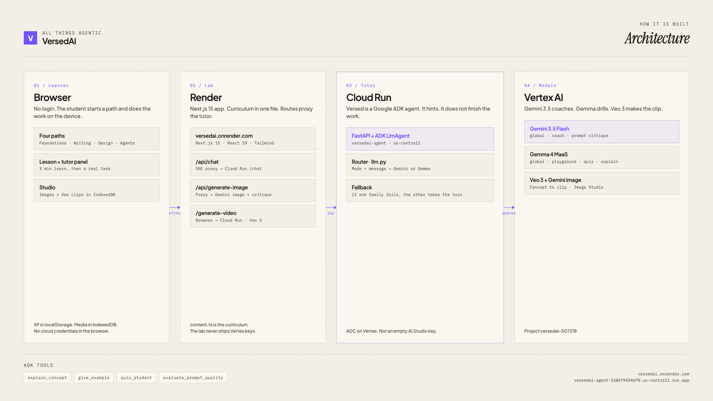

# VersedAI

### A generative AI lab. Short lesson, real task, a tutor that hints.

Most students already use AI. Almost none of them were taught how. VersedAI is the lab: four paths, a challenge on each lesson, and Versed (a Google ADK tutor) that gives the smallest useful hint instead of the finished answer.

Type a raw concept. Gemini 3.5 Flash writes the shot. Veo 3.1 Fast renders the clip. Images and videos stay in Studio on this device. No login.

**[Open the live lab →](https://versedai.onrender.com)** · [Tutor health](https://versedai-agent-158479424670.us-central1.run.app/health) · [Architecture](./docs/versedai-architecture.png)

Built for **All Things Agentic**.



## How it works

**1. Who you are.** Learner type and a name. The home MacBook plays this loop.

**2. A path.** Foundations, writing, graphic design, or agents. A few minutes of theory, then a real task.

**3. The work stays.** Finish the path, earn the badge. Images and Veo clips auto-save in [Studio](https://versedai.onrender.com/studio). Refresh does not throw them away.

When they get stuck, Versed sits in the lesson panel and at `/chat`. Gemma 4 runs drills and quizzes. Gemini 3.5 Flash coaches. It does not dump the answer.

## Live URLs

| What | URL |
|---|---|
| Lab | https://versedai.onrender.com |
| Tutor (Cloud Run) | https://versedai-agent-158479424670.us-central1.run.app |
| Health | https://versedai-agent-158479424670.us-central1.run.app/health |
| Chat | https://versedai.onrender.com/chat |
| Paths | https://versedai.onrender.com/tracks |
| Studio | https://versedai.onrender.com/studio |
| Concept to clip | https://versedai.onrender.com/tracks/image-gen/concept-to-clip |
| Repo | https://github.com/fozagtx/VersedAI |

## Paths

| Path | Badge | URL |
|---|---|---|
| AI Foundations | Foundations | https://versedai.onrender.com/tracks/what-is-ai |
| AI Writing | Writer | https://versedai.onrender.com/tracks/prompting |
| AI Graphic Design | Designer | https://versedai.onrender.com/tracks/image-gen |
| AI Agents | Builder | https://versedai.onrender.com/tracks/ai-agents |

Graphic Design includes **Concept to clip**. Dump a raw idea. Gemini 3.5 writes a Veo shot. `veo-3.1-fast-generate-001` in `us-central1` returns an MP4. The file lands in Studio. This Vertex project does not have Veo 3.0. 3.1 Fast is what actually renders.

## Stack

| Layer | What | Where |
|---|---|---|
| Lab | Next.js 15 | Render (`versedai`, `rootDir: client`) |
| Tutor | FastAPI + Google ADK `LlmAgent` | Cloud Run `us-central1` |
| Coach | Gemini 3.5 Flash | Vertex `global` |
| Drills | Gemma 4 `gemma-4-26b-a4b-it-maas` | Vertex `global` |
| Images | Gemini image | Vertex, via `/api/generate-image` |
| Video | Veo 3.1 Fast `veo-3.1-fast-generate-001` | Vertex `us-central1`, via `/generate-video` |
| Progress | `localStorage` (`versedai_xp`) | Browser, no login |
| Studio files | IndexedDB (`versedai_studio`) | Browser. Survives refresh. Download anytime. |

The lab proxies `/api/chat` and image routes to Cloud Run. Video jobs call Cloud Run directly (`NEXT_PUBLIC_BACKEND_URL`) so Veo can take a minute. The browser never holds Vertex credentials.

ADK tools: `explain_concept`, `give_example`, `quiz_student`, `evaluate_prompt_quality`. `server/llm.py` routes drills to Gemma and coaching to Gemini, then fails over.

## Does vs will not

| Does | Will not |
|---|---|
| Name the model that spoke (`event: meta`) | Fake a clip if Veo is down |
| Hint, then ask them to try | Dump the finished homework answer |
| Save images and videos on this device | Require an account |
| Report Gemini, Gemma, and Veo on `/health` | Pretend Veo 3.0 works on this project |

## Run locally

No GCP project required. The example env already points at the live Cloud Run tutor.

```bash
git clone https://github.com/fozagtx/VersedAI.git
cd VersedAI/client
npm install
cp .env.local.example .env.local
npm run dev
```

Open http://localhost:3000.

| Optional | Command |
|---|---|
| Local tutor | `cd server && python3 -m venv .venv && source .venv/bin/activate && pip install -r requirements.txt && cp .env.example .env && python3 -m uvicorn main:app --reload --port 8000 --host 0.0.0.0` |
| Point the lab at it | `BACKEND_URL=http://localhost:8000` and `NEXT_PUBLIC_BACKEND_URL=http://localhost:8000` in `client/.env.local` |

Local tutor needs Vertex ADC **or** `GEMINI_API_KEY`. Coach is Gemini 3.5 Flash on Vertex `global`. Clips are Veo 3.1 Fast on Vertex `us-central1`.

## Smoke checks

No GCP project required. First call after idle can 502. Retry once. Veo takes about a minute.

| Check | Command | Pass |
|---|---|---|
| Health | `curl -sS https://versedai-agent-158479424670.us-central1.run.app/health` | JSON below |
| Gemma drill | `curl -sS -N -X POST https://versedai-agent-158479424670.us-central1.run.app/chat -H "Content-Type: application/json" -d '{"message":"What is an AI agent in two sentences?","mode":"auto"}'` | `event: meta` names Gemma, then tokens |
| Gemini coach | `curl -sS -N -X POST https://versedai-agent-158479424670.us-central1.run.app/chat -H "Content-Type: application/json" -d '{"message":"I am stuck on the image challenge. Smallest hint.","mode":"auto"}'` | `event: meta` names Gemini 3.5 Flash, then a hint |
| Lab proxy | `curl -sS -N -X POST https://versedai.onrender.com/api/chat -H "Content-Type: application/json" -d '{"message":"What is an AI agent in two sentences?","mode":"auto"}'` | Same tutor, via Render |
| Router | `cd server && python3 -c "from llm import choose_family; assert choose_family('auto','hello')=='gemini'; assert choose_family('auto','Explain tokens')=='gemma'; assert choose_family('auto','I am stuck')=='gemini'; print('router ok')"` | `router ok` |

Health:

```json
{"status":"ok","model":"gemini-3.5-flash","gemma":"gemma-4-26b-a4b-it-maas","veo":"veo-3.1-fast-generate-001","platform":"VersedAI","runtime":"vertex"}
```

## Configuration

| Variable | Where | Value |
|---|---|---|
| `BACKEND_URL` | `client/.env.local`, Render | https://versedai-agent-158479424670.us-central1.run.app |
| `NEXT_PUBLIC_BACKEND_URL` | `client/.env.local`, Render | Same Cloud Run URL. Browser uses it for Veo so Render does not time out. |
| `GOOGLE_GENAI_USE_VERTEXAI` | Cloud Run | `true` |
| `GOOGLE_CLOUD_PROJECT` | Cloud Run | `versedai-507218` |
| `GOOGLE_CLOUD_LOCATION` | Cloud Run | `us-central1` |
| `GEMINI_MODEL` | Cloud Run | `gemini-3.5-flash` |
| `GEMINI_LOCATION` | Cloud Run | `global` |
| `GEMMA_MODEL` | Cloud Run | `gemma-4-26b-a4b-it-maas` |
| `GEMMA_LOCATION` | Cloud Run | `global` |
| `VEO_MODEL` | Cloud Run | `veo-3.1-fast-generate-001` |
| `VEO_LOCATION` | Cloud Run | `us-central1` |

## Deploy

| Target | How |
|---|---|
| Lab | Push `main` → Render auto-deploy. Blueprint: [`render.yaml`](./render.yaml) |
| Tutor | `cd server && gcloud run deploy versedai-agent --source . --project versedai-507218 --region us-central1 --allow-unauthenticated --timeout 300` |

## Repo

| Path | Role |
|---|---|
| `client/` | Next.js lab |
| `server/` | FastAPI + ADK tutor |
| `client/lib/content.ts` | Curriculum |
| `client/lib/studio-store.ts` | IndexedDB for images and videos |
| `client/components/MacBookHero.tsx` | Hero laptop |
| `client/components/VideoStudio.tsx` | Concept → Veo 3.1 Fast |
| `server/llm.py` | Gemini 3.5 / Gemma router |
| `server/video_gen.py` | Concept expand + Veo 3.1 Fast |
| `docs/versedai-architecture.png` | Architecture diagram |
